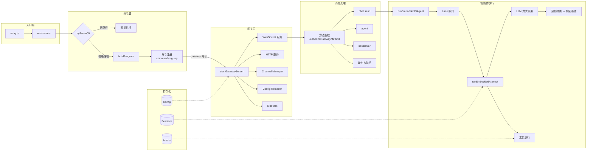

# 00 学习路线与阅读地图

## 目标

你不是来“背 API”，而是来理解这个项目是怎么被搭起来的，后续能自己做一个类似系统。

## 一句话架构

`CLI` 发命令 -> `Gateway` 启动和编排 -> `Channel` 收发消息 -> `Routing` 选 agent/session -> `Auto-Reply` 调模型生成回复 -> `Outbound` 发回通道 -> `Config/Session/Media` 持久化状态。

## 整体模块关系图

## 核心源码入口（先记住）

- CLI 启动: `src/entry.ts`, `src/cli/run-main.ts`
- 命令注册: `src/cli/program/build-program.ts`, `src/cli/program/command-registry.ts`
- 网关主入口: `src/gateway/server.impl.ts`
- 路由: `src/routing/resolve-route.ts`
- 自动回复: `src/auto-reply/reply/get-reply.ts`, `src/auto-reply/reply/get-reply-run.ts`
- 插件: `src/plugins/loader.ts`, `src/plugins/registry.ts`
- 配置/会话: `src/config/io.ts`, `src/config/sessions/store.ts`
- 媒体: `src/media/store.ts`, `src/media/server.ts`

## 建议学习节奏

1. 先看 `01` 到 `03`，把“程序怎么跑起来”搞清楚。
2. 再看 `04` 到 `06`，把“消息怎么进来、怎么路由、怎么回复”搞清楚。
3. 最后看 `07` 到 `10`，把“可扩展性和工程化能力”搞清楚。
4. 再看 `12` 到 `20`，把“智能体框架核心”吃透（这是重点）。
5. 最后看 `27` 到 `35`，把“Gateway 控制平面”吃透（连接、鉴权、分发、运维）。
6. 再看 `36` 到 `41`，把“Gateway HTTP 面与生命周期管理”吃透（OpenAI/OpenResponses、热重载、优雅关停、hooks）。
7. 收尾看 `42` 到 `43`，把“协议设计 + 复刻落地清单”收进自己的工程方法论。
8. 最后看 `44`，做“核心重点标记 + 遗漏复查”，确定下一轮补齐清单。
9. 补读 `45` 到 `52`，把"系统胶水层"补齐（运行时边界、tailscale、服务发现、lane 并发、模型目录、sessionKey 桥接、memory sidecar、审批内核）。
10. 补读 `54` 到 `59`，把"扩展能力层"补齐（安全模块与审计、定时任务、守护进程管理、浏览器自动化集成、语音合成系统、通道适配器实现索引）。

## 每个模块都按同一模板看

- 步骤一：执行链路拆解（谁调用谁）
- 步骤二：细节拆解（参数、状态、边界条件）
- 补充思考（还有什么没覆盖）

