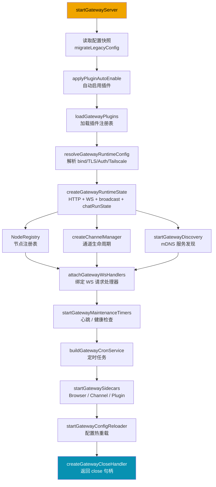

# 03 Gateway 运行时编排

## 模块目标

理解网关是如何一次性把配置、插件、通道、WS/HTTP、定时器、热重载都编排起来。

## 步骤一：实现拆解（执行链路）

主入口: `src/gateway/server.impl.ts` 的 `startGatewayServer(...)`

### Gateway 启动序列图

1. 读取并校验配置，迁移旧配置
2. 自动启用插件（如果满足规则）
3. 加载插件注册表（方法、通道、provider、hooks、HTTP 路由）
4. 解析运行时配置（bind/auth/tailscale/control-ui/tls）
5. 创建网关运行时状态（HTTP + WS + 广播 + 聊天运行态）
6. 启动通道管理器、发现服务、心跳、cron、维护任务
7. 绑定 WS handler 与网关 methods
8. 启动 sidecars（browser/channel/plugin services）
9. 启动配置热重载
10. 返回 `close()`，统一关停

## 步骤二：细粒度讲解（小白版）

1. 配置入口先“修路”
- 读取配置快照，检查 legacy 项
- 能自动迁移就迁移，不能迁移就抛出明确错误
- 这样网关不在“半坏配置”下启动

2. 插件先加载再启动服务
- 插件不仅有工具，还可注入 gateway methods / http 路由 / 通道
- 所以插件加载在核心状态创建前完成

3. 运行态是一个“大上下文对象”
- `createGatewayRuntimeState` 返回 `broadcast`、`clients`、`chatRunState` 等共享状态
- 后续 WS handlers、channel manager、node subsystem 都用这个共享状态

4. WS/HTTP 对外接口分层
- `attachGatewayWsHandlers` 绑定连接与请求处理
- `server-methods.ts` 负责方法级鉴权（role + scope）
- 插件 methods 与核心 methods 在同一个分发层组合

5. 热重载不是“重启进程”，而是尽量热更新
- `startGatewayConfigReloader` 监听配置变化
- 可热更新的内容直接 `applyHotReload`
- 不可热更新的再请求重启

6. 关闭流程非常完整
- 先执行 `gateway_stop` hook
- 再停 timer / channels / ws / http / tailscale / plugin services
- 最后释放限流器与监听器，避免资源泄漏

