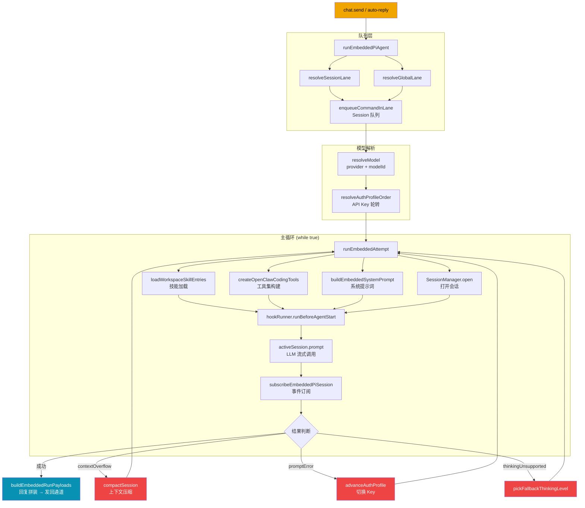

# 12 智能体框架总览

## 模块目标

把 OpenClaw 的“智能体核心引擎”先看成一个整体，再进入各子模块细拆。

## Agent 执行链路全景图

## 步骤一：实现拆解（执行链路）

1. 上层入口:
- `src/commands/agent.ts`
- `src/auto-reply/reply/agent-runner-execution.ts`

2. 核心执行入口:
- `src/agents/pi-embedded.ts`
- `src/agents/pi-embedded-runner.ts`
- `src/agents/pi-embedded-runner/run.ts`

3. 核心子系统:
- 运行尝试: `src/agents/pi-embedded-runner/run/attempt.ts`
- 工具系统: `src/agents/pi-tools.ts`, `src/agents/openclaw-tools.ts`
- 流式事件: `src/agents/pi-embedded-subscribe.ts`
- 并发模型: `src/agents/pi-embedded-runner/lanes.ts`, `src/process/command-queue.ts`
- 子智能体: `src/agents/tools/sessions-spawn-tool.ts`, `src/agents/subagent-registry.ts`
- 技能系统: `src/agents/skills.ts`, `src/agents/skills/refresh.ts`
- 失败恢复: `src/agents/model-fallback.ts`, `src/agents/pi-embedded-runner/run.ts`

## 步骤二：细粒度讲解（小白版）

1. 这套框架的职责是“把一次用户请求跑完”
- 选模型与认证
- 组装 system prompt + skills + tools
- 流式执行并回传片段
- 处理错误、超时、压缩、回退

2. 这是“多层编排”而不是“一个大函数”
- 上层决定什么时候跑
- 中层决定怎么跑（队列、lane、session）
- 下层负责具体执行（PI session + 工具调用）

3. 它是“状态机 + 事件流”
- 生命周期事件: start/update/end/error
- tool 事件与 assistant 文本事件并行
- 最终由上层转成对外回复 payload

