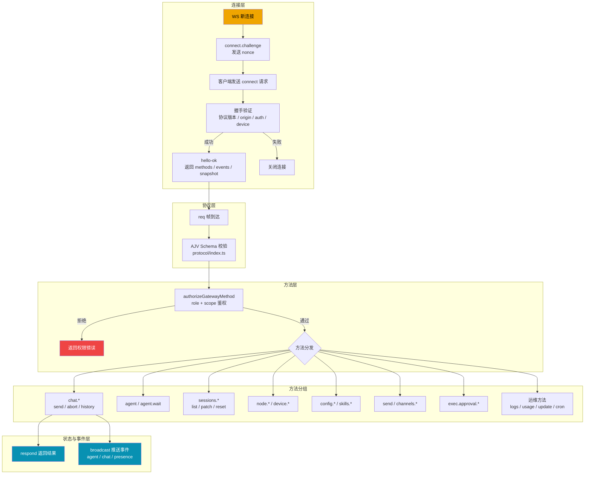

# 27 Gateway 控制平面总览

这一篇先回答一个问题：`openclaw gateway run` 启动后，网关到底怎么把“连接、鉴权、方法调用、事件广播”串起来。

## 控制平面架构图

## 步骤一：执行链路拆解（先看全局）

1. 入口在 `src/gateway/server.impl.ts` 的 `startGatewayServer(...)`。
2. 运行态容器由 `src/gateway/server-runtime-state.ts` 的 `createGatewayRuntimeState(...)` 创建（HTTP/WS server、clients、broadcast、dedupe、chat run 状态）。
3. WS 连接入口由 `src/gateway/server-ws-runtime.ts` -> `attachGatewayWsConnectionHandler(...)` 接管。
4. 每个新连接先收到 `connect.challenge`（带 `nonce`），随后必须先发 `connect` 请求。
5. `src/gateway/server/ws-connection/message-handler.ts` 完成 `connect` 握手：协议版本、origin、auth、device 签名、pairing。
6. 握手成功后返回 `hello-ok`，里面包含：可调用 methods、events、snapshot、策略上限。
7. 后续所有 `req` 帧进入 `src/gateway/server-methods.ts` 的 `handleGatewayRequest(...)`。
8. `handleGatewayRequest` 先做 `authorizeGatewayMethod(...)` scope 校验，再分发到具体 handler（`chat/send/sessions/node/...`）。
9. handler 通过 `respond(...)` 返回结果；异步事件通过 `broadcast(...)` 推送（`agent/chat/presence/heartbeat/...`）。
10. 连接断开时执行清理：presence、node 注册、订阅关系、pending invoke 等。

## 步骤二：细粒度拆解（模块怎么配合）

### A. 控制平面的 4 层结构

1. 连接层：`ws-connection.ts` + `message-handler.ts`
- 负责“谁能连进来，连进来后身份是什么”。

2. 协议层：`protocol/index.ts`
- 负责帧结构校验（AJV），错误码统一，参数 schema 统一。

3. 方法层：`server-methods.ts` + `server-methods/*`
- 负责“这个 method 是否允许执行，以及执行逻辑是什么”。

4. 状态与事件层：`server-runtime-state.ts` + `server-broadcast.ts` + `server-chat.ts`
- 负责连接集合、幂等缓存、流式事件、慢消费者丢弃策略。

### B. 你要记住的三个“总闸”

1. 连接总闸：`connect` 握手必须成功，否则 WS 直接关闭。
2. 权限总闸：`authorizeGatewayMethod`，role/scope 不符合直接拒绝。
3. 带宽总闸：`MAX_PAYLOAD_BYTES` + `MAX_BUFFERED_BYTES`，防止单连接拖垮系统。

