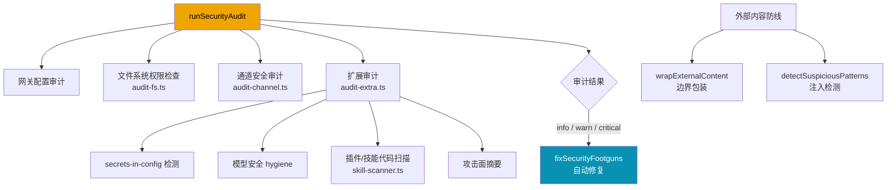

# 54 安全模块与审计系统

## 模块目标

理解 OpenClaw 的安全审计体系：配置扫描、文件权限检查、外部内容防注入、技能代码扫描、自动修复。

## 整体架构

## 步骤一：实现拆解（执行链路）

核心入口：`src/security/audit.ts`

1. `runSecurityAudit(opts)` — 编排完整审计管线
2. `audit-fs.ts` — 检查状态目录和配置文件权限（Unix chmod / Windows icacls）
3. `audit-channel.ts` — 检查各通道的开放策略（如 Telegram 群聊是否对所有人开放）
4. `audit-extra.ts` — 扩展检查：secrets 泄露、模型安全、Docker 沙箱、节点 deny 模式
5. `skill-scanner.ts` — 静态代码扫描（child_process、eval、crypto-mining、网络外泄等）
6. `fix.ts` — `fixSecurityFootguns()` 自动修复权限和配置问题

## 步骤二：细粒度讲解（小白版）

### A. 审计结果分三级

- **info** — 信息提示，不影响运行
- **warn** — 潜在风险，建议修复
- **critical** — 严重安全问题，应立即修复

### B. 文件权限审计（audit-fs.ts）

- 检查状态目录和配置文件是否 world-readable / world-writable
- 生成平台特定的修复命令（Unix 用 `chmod`，Windows 用 `icacls`）

### C. 外部内容防注入（external-content.ts）

- `wrapExternalContent()` — 给邮件、webhook、网页抓取内容加安全边界标记
- `detectSuspiciousPatterns()` — 正则检测注入尝试（"ignore previous instructions"、`eval`、`rm -rf` 等）
- Unicode 同形字归一化防止标记绕过

### D. 技能代码扫描（skill-scanner.ts）

扫描规则包括：
- `dangerous-exec` — shell 命令执行
- `dynamic-code-execution` — eval / new Function
- `crypto-mining` — 挖矿行为
- `suspicious-network` — 非标准端口 WebSocket
- `potential-exfiltration` — 读文件 + 发网络
- `obfuscated-code` — hex/base64 混淆
- `env-harvesting` — 环境变量收集 + 外发

### E. 危险工具注册表（dangerous-tools.ts）

- `DEFAULT_GATEWAY_HTTP_TOOL_DENY` — HTTP 接口默认禁用的工具
- `DANGEROUS_ACP_TOOLS` — 始终需要显式审批的工具（如 `exec`、`fs_write`、`apply_patch`）

### F. 时间安全比较（secret-equal.ts）

- `safeEqualSecret()` — 使用 `crypto.timingSafeEqual` 防止时序攻击

## 核心源码入口

| 文件 | 职责 |
|------|------|
| `src/security/audit.ts` | 审计编排主入口 |
| `src/security/audit-fs.ts` | 文件系统权限审计 |
| `src/security/audit-channel.ts` | 通道安全审计 |
| `src/security/audit-extra.ts` | 扩展审计（secrets / 模型 / 插件） |
| `src/security/skill-scanner.ts` | 技能代码静态扫描 |
| `src/security/external-content.ts` | 外部内容防注入 |
| `src/security/dangerous-tools.ts` | 危险工具注册表 |
| `src/security/fix.ts` | 自动修复 |
| `src/security/secret-equal.ts` | 时间安全比较 |
