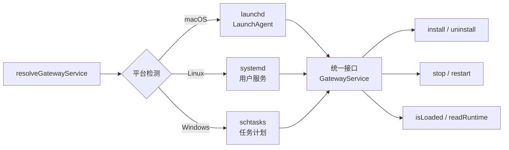

# 56 守护进程管理

## 模块目标

理解 OpenClaw 如何以系统服务形式运行：跨平台服务安装、启停控制、状态检查。

## 步骤一：实现拆解（执行链路）

核心入口：`src/daemon/service.ts` 的 `resolveGatewayService()`

## 步骤二：细粒度讲解（小白版）

### A. 三平台统一接口

`GatewayService` 提供统一方法，内部自动适配平台：

| 方法 | macOS | Linux | Windows |
|------|-------|-------|---------|
| `install` | 写 .plist → `launchctl load` | 写 .service → `systemctl enable` | `schtasks /Create` |
| `uninstall` | `launchctl unload` → 删 .plist | `systemctl disable` → 删 .service | `schtasks /Delete` |
| `stop` | `launchctl stop` | `systemctl stop` | `schtasks /End` |
| `restart` | `launchctl kickstart` | `systemctl restart` | stop → start |
| `isLoaded` | `launchctl list` | `systemctl is-enabled` | `schtasks /Query` |
| `readRuntime` | 解析 launchctl 输出 | 解析 systemctl 输出 | 解析 schtasks 输出 |

### B. macOS LaunchAgent（launchd.ts）

- 安装位置：`~/Library/LaunchAgents/ai.openclaw.gateway.plist`
- 通过 `launchd-plist.ts` 生成 XML plist 文件
- 支持环境变量传递和日志路径配置

### C. Linux systemd（systemd.ts）

- 安装位置：`~/.config/systemd/user/openclaw-gateway.service`
- 通过 `systemd-unit.ts` 生成 unit 文件
- `systemd-linger.ts` 管理 `loginctl enable-linger`，确保服务在用户注销后仍运行

### D. Windows 任务计划（schtasks.ts）

- 通过 `schtasks.exe` 创建/管理计划任务
- 在状态目录生成 `.cmd` 启动脚本

### E. 辅助功能

- `service-audit.ts` — 检查安装的服务命令是否与当前二进制一致（检测漂移）
- `diagnostics.ts` — 收集运行中守护进程的诊断信息
- `node-service.ts` — 管理配套的 Node Host 服务

## 核心源码入口

| 文件 | 职责 |
|------|------|
| `src/daemon/service.ts` | 平台抽象层主入口 |
| `src/daemon/launchd.ts` | macOS LaunchAgent 实现 |
| `src/daemon/systemd.ts` | Linux systemd 实现 |
| `src/daemon/schtasks.ts` | Windows 任务计划实现 |
| `src/daemon/constants.ts` | 服务名常量 |
| `src/daemon/service-audit.ts` | 安装漂移检测 |
