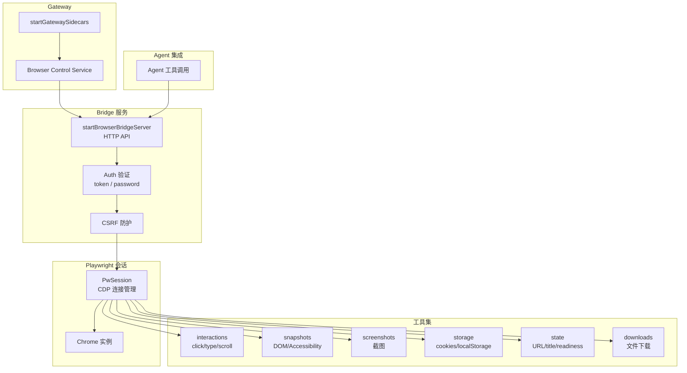

# 57 浏览器自动化集成

## 模块目标

理解 OpenClaw 的浏览器自动化层：Playwright + CDP 会话管理、工具集、HTTP Bridge 服务。

## 整体架构

## 步骤一：实现拆解（执行链路）

核心入口：`src/browser/bridge-server.ts`

1. `startBrowserBridgeServer()` — 启动本地 HTTP 服务（仅 loopback）
2. 请求到达 → Auth 验证 + CSRF 检查
3. 路由到具体工具模块（`routes/` 目录下的 Express 路由）
4. 工具模块通过 `PwSession` 操作 Playwright 浏览器实例
5. `PwSession` 通过 CDP WebSocket 连接到 Chrome

## 步骤二：细粒度讲解（小白版）

### A. 两种 Chrome 连接方式

- **本地启动** — `chrome.ts` 找到 Chrome 可执行文件，启用远程调试端口
- **远程连接** — 通过 CDP WebSocket URL 连接已有实例

### B. 工具模块一览

| 模块 | 能力 |
|------|------|
| `interactions` | 点击、输入、滚动、悬停、键盘、文件选择 |
| `snapshots` | Accessibility 角色 DOM 快照（供 AI 使用） |
| `screenshots` | 全页/元素截图（含选择器定位） |
| `storage` | 读写 cookies、localStorage、sessionStorage |
| `state` | 页面 URL、标题、就绪状态查询 |
| `downloads` | 文件下载事件监听与保存 |
| `trace` | Playwright tracing（调试用） |

### C. 安全设计

- Bridge 服务仅绑定 loopback（127.0.0.1）
- 所有请求需要 token 或 password 认证
- 变更操作有 CSRF 防护
- 请求支持 abort 信号

### D. AI 集成

- `pw-ai.ts` / `pw-ai-state.ts` — 将浏览器状态暴露给 Agent 工具调用
- Agent 可以通过浏览器工具与网页交互（搜索、填表、提取信息）

## 核心源码入口

| 文件 | 职责 |
|------|------|
| `src/browser/bridge-server.ts` | HTTP Bridge 服务 |
| `src/browser/pw-session.ts` | Playwright 会话管理 |
| `src/browser/pw-tools-core.ts` | 工具集聚合导出 |
| `src/browser/chrome.ts` | Chrome 进程管理 |
| `src/browser/cdp.ts` | 低级 CDP 工具 |
| `src/browser/server.ts` | 网关侧服务映射 |
| `src/browser/control-auth.ts` | 认证层 |
