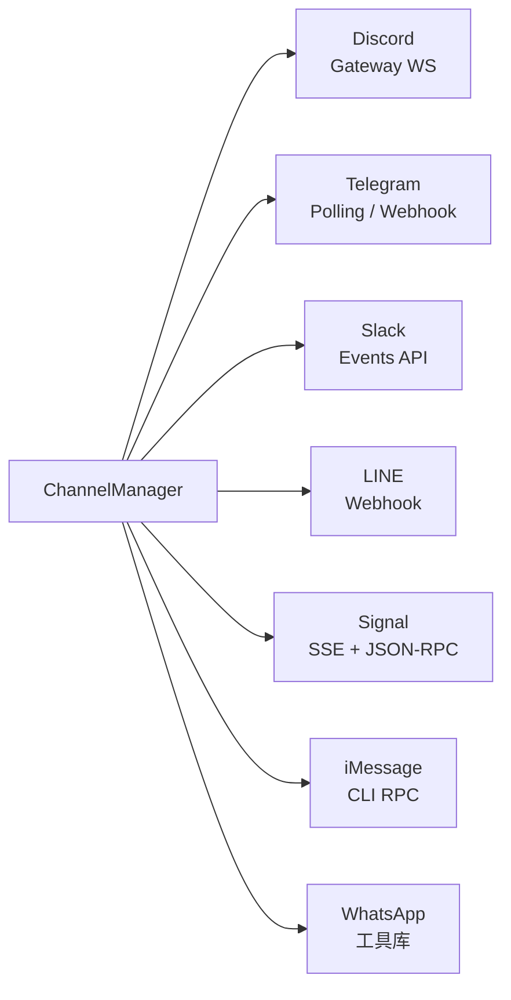

# 59 通道适配器实现索引

## 模块目标

总览 OpenClaw 支持的所有通道适配器（Channel Adapter）的实现特点、传输方式和核心能力。

## 通道适配器一览

## 各通道详细对比

| 通道 | 传输方式 | 发送能力 | 独特能力 |
|------|----------|----------|----------|
| **Discord** | Gateway WebSocket | 文本、投票、贴纸、语音消息 | 最功能丰富：语音消息(OGG/Opus)、公会管理(封禁/踢人/超时/角色)、emoji/贴纸上传、线程管理、PluralKit 代理检测、特权 Intent 探测 |
| **Telegram** | 长轮询 或 Webhook | 文本、投票、反应、语音 | 双传输模式、HTTP 代理支持、流式草稿发送分块、行内按钮、原生命令菜单、贴纸缓存、群组超级群组迁移处理 |
| **Slack** | Events API (HTTP) | 文本 | 最丰富的操作 API：读取历史/编辑/删除/置顶/取消置顶/反应/列出反应、斜杠命令、线程模式、双令牌(app+bot) |
| **LINE** | Webhook (HTTP) | 文本、图片、位置、Flex、模板、快速回复 | 最精细的消息类型：Flex Message 模板（10+种）、Rich Menu CRUD、Markdown→LINE 转换器、加载动画 keepalive |
| **Signal** | SSE + JSON-RPC | 文本、附件、反应、已读回执 | 自动启动 signal-cli 守护进程、原生文本样式（粗体/斜体/等宽）、反应发送/撤回、SSE 重连 |
| **iMessage** | CLI RPC (imsg) | 文本、文件附件 | macOS 专属、imsg RPC 桥接、iMessage+SMS 服务自动检测、配对请求流程 |
| **WhatsApp** | (工具库) | — | JID 规范化（用户/LID/群组）、白名单强制执行 |

## Discord (`src/discord/`)

### 核心文件

- `monitor/provider.ts` — 通过 Discord Gateway WebSocket 连接，监听消息事件
- `send.outbound.ts` / `send.messages.ts` — REST API 发送
- `probe.ts` — 探测 bot token 和特权 Intent
- `voice-message.ts` — OGG/Opus 语音消息支持
- `pluralkit.ts` — PluralKit 代理检测

### 关键能力

- 公会管理：封禁、踢人、超时、角色分配
- 频道管理：权限设置、计划活动
- 线程管理：创建、归档
- 原生斜杠命令支持

## Telegram (`src/telegram/`)

### 核心文件

- `monitor.ts` — grammY runner 长轮询（含指数退避、409 冲突检测）
- `webhook.ts` — Webhook 模式
- `send.ts` / `draft-stream.ts` — 流式发送 + 分块
- `proxy.ts` — HTTP 代理支持
- `inline-buttons.ts` / `model-buttons.ts` — 交互式按钮

### 关键能力

- 更新偏移量持久化（重启不丢消息）
- Grammy 限流中间件
- 原生命令菜单注册

## Slack (`src/slack/`)

### 核心文件

- `monitor/provider.ts` — Events API 事件驱动
- `actions.ts` — 最丰富的操作集：read/send/edit/delete/react/pin/unpin
- `send.ts` — 发送消息
- `scopes.ts` — 权限范围验证

### 关键能力

- 最丰富的消息操作 API
- Socket Mode 和 Events API 双模
- `thread_ts` 线程解析

## LINE (`src/line/`)

### 核心文件

- `monitor.ts` — Webhook 模式，loading animation keepalive
- `flex-templates.ts` — 10+ Flex Message 模板
- `rich-menu.ts` — Rich Menu 完整 CRUD
- `markdown-to-line.ts` — Markdown 到 LINE 消息转换
- `reply-chunks.ts` — 5000 字符限制下的分块发送

### 关键能力

- 最精细的消息类型支持
- Markdown 表格 → Flex Bubble 自动转换
- Reply Token / Push Message 自动切换

## Signal (`src/signal/`)

### 核心文件

- `monitor.ts` — SSE 事件循环 + 可选自动启动 signal-cli 守护进程
- `daemon.ts` — signal-cli HTTP 守护进程管理
- `send.ts` — 发送消息 + Markdown → Signal 原生样式
- `format.ts` — `markdownToSignalText` 生成 `SignalTextStyleRange`

### 关键能力

- 双模：自动启动 signal-cli 或连接已有实例
- 原生文本样式（粗体/斜体/等宽）
- 已读回执和输入指示

## iMessage (`src/imessage/`)

### 核心文件

- `monitor/monitor-provider.ts` — 通过 imsg CLI RPC 轮询
- `send.ts` — 支持文本和文件附件
- `client.ts` — IMessageRpcClient

### 关键能力

- macOS 专属（通过 imsg 桥接工具）
- 同时支持 iMessage 和 SMS
- 多种寻址方式（电话号码、chat GUID、chat ID）
