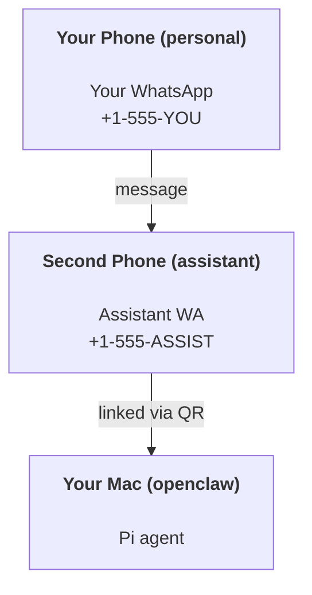

# 使用 OpenClaw 构建个人助手

OpenClaw 是一个面向 **Pi** 智能体（Agent）的 WhatsApp + Telegram + Discord + iMessage 网关（Gateway）。插件可添加 Mattermost 支持。本指南是"个人助手"设置方案：一个专用的 WhatsApp 号码，表现为你的全天候智能体。

---

## ⚠️ 安全第一

你正在让一个智能体具备以下能力：

- 在你的机器上运行命令（取决于你的 Pi 工具设置）
- 在你的工作区（Workspace）中读写文件
- 通过 WhatsApp/Telegram/Discord/Mattermost（插件）发送消息

保守起步：

- 始终设置 `channels.whatsapp.allowFrom`（永远不要在你的个人 Mac 上开放给所有人）。
- 为助手使用专用的 WhatsApp 号码。
- 心跳默认每 30 分钟一次。在你信任此设置之前，通过设置 `agents.defaults.heartbeat.every: "0m"` 禁用它。

---

## 前置条件

- OpenClaw 已安装并完成入门引导 — 如果尚未完成，请参阅 [快速入门](/start/getting-started)
- 一个用于助手的第二个手机号（SIM/eSIM/预付费）

---

## 双手机设置（推荐）

你需要的配置如下：



如果你将个人 WhatsApp 链接到 OpenClaw，你收到的每条消息都会变成"智能体输入"。这通常不是你想要的。

---

## 5 分钟快速开始

1. 配对 WhatsApp Web（显示 QR 码；用助手手机扫描）：

```bash
openclaw channels login
```

2. 启动网关（Gateway）（保持运行）：

```bash
openclaw gateway --port 18789
```

3. 在 `~/.openclaw/openclaw.json` 中放入一个最简配置：

```json5
{
  channels: { whatsapp: { allowFrom: ["+15555550123"] } },
}
```

现在从你的白名单手机向助手号码发送消息。

入门引导完成后，我们会自动打开仪表盘并打印一个干净的（非 Token 化的）链接。如果提示认证，请将 `gateway.auth.token` 中的 Token 粘贴到控制面板 UI 设置中。稍后重新打开：`openclaw dashboard`。

---

## 为智能体提供工作区（AGENTS）

OpenClaw 从其工作区（Workspace）目录读取操作指令和"记忆"。

默认情况下，OpenClaw 使用 `~/.openclaw/workspace` 作为智能体工作区，并会在设置/首次运行时自动创建它（以及初始的 `AGENTS.md`、`SOUL.md`、`TOOLS.md`、`IDENTITY.md`、`USER.md`、`HEARTBEAT.md`）。`BOOTSTRAP.md` 仅在工作区全新时创建（删除后不会再出现）。`MEMORY.md` 是可选的（不会自动创建）；存在时会为普通会话加载。子智能体会话仅注入 `AGENTS.md` 和 `TOOLS.md`。

提示：将此文件夹视为 OpenClaw 的"记忆"，并将其作为 git 仓库（最好是私有的），这样你的 `AGENTS.md` + 记忆文件就有了备份。如果安装了 git，全新的工作区会自动初始化。

```bash
openclaw setup
```

完整的工作区布局和备份指南：[智能体（Agent）工作区](/concepts/agent-workspace)
记忆工作流：[记忆](/concepts/memory)

可选：通过 `agents.defaults.workspace` 选择不同的工作区（支持 `~`）。

```json5
{
  agent: {
    workspace: "~/.openclaw/workspace",
  },
}
```

如果你已经从仓库提供了自己的工作区文件，可以完全禁用引导文件的创建：

```json5
{
  agent: {
    skipBootstrap: true,
  },
}
```

---

## 将其变成"助手"的配置

OpenClaw 默认就是一个不错的助手设置，但你通常需要调整：

- `SOUL.md` 中的角色/指令
- 思考默认值（如需要）
- 心跳（在你信任它之后）

示例：

```json5
{
  logging: { level: "info" },
  agent: {
    model: "anthropic/claude-opus-4-6",
    workspace: "~/.openclaw/workspace",
    thinkingDefault: "high",
    timeoutSeconds: 1800,
    // Start with 0; enable later.
    heartbeat: { every: "0m" },
  },
  channels: {
    whatsapp: {
      allowFrom: ["+15555550123"],
      groups: {
        "*": { requireMention: true },
      },
    },
  },
  routing: {
    groupChat: {
      mentionPatterns: ["@openclaw", "openclaw"],
    },
  },
  session: {
    scope: "per-sender",
    resetTriggers: ["/new", "/reset"],
    reset: {
      mode: "daily",
      atHour: 4,
      idleMinutes: 10080,
    },
  },
}
```

---

## 会话（Session）与记忆

- 会话文件：`~/.openclaw/agents/<agentId>/sessions/\{\{SessionId\}\}.jsonl`
- 会话元数据（Token 用量、上次路由等）：`~/.openclaw/agents/<agentId>/sessions/sessions.json`（旧版：`~/.openclaw/sessions/sessions.json`）
- `/new` 或 `/reset` 为该聊天启动新会话（可通过 `resetTriggers` 配置）。如果单独发送，智能体会回复一个简短的问候以确认重置。
- `/compact [instructions]` 压缩会话上下文并报告剩余的上下文预算。

---

## 心跳（主动模式）

默认情况下，OpenClaw 每 30 分钟运行一次心跳，提示词为：
`Read HEARTBEAT.md if it exists (workspace context). Follow it strictly. Do not infer or repeat old tasks from prior chats. If nothing needs attention, reply HEARTBEAT_OK.`
设置 `agents.defaults.heartbeat.every: "0m"` 可禁用。

- 如果 `HEARTBEAT.md` 存在但实际上为空（仅有空行和 Markdown 标题如 `# Heading`），OpenClaw 会跳过心跳运行以节省 API 调用。
- 如果文件缺失，心跳仍会运行，由模型决定做什么。
- 如果智能体回复 `HEARTBEAT_OK`（可选择带有短填充；参见 `agents.defaults.heartbeat.ackMaxChars`），OpenClaw 会抑制该次心跳的出站消息投递。
- 心跳运行完整的智能体回合 — 更短的间隔会消耗更多 Token。

```json5
{
  agent: {
    heartbeat: { every: "30m" },
  },
}
```

---

## 媒体输入输出

入站附件（图片/音频/文档）可以通过模板传递给你的命令：

- `\{\{MediaPath\}\}`（本地临时文件路径）
- `\{\{MediaUrl\}\}`（伪 URL）
- `\{\{Transcript\}\}`（如果启用了音频转录）

来自智能体的出站附件：在单独一行包含 `MEDIA:<path-or-url>`（无空格）。示例：

```text
Here's the screenshot.
MEDIA:https://example.com/screenshot.png
```

OpenClaw 会提取这些内容并随文本一起作为媒体发送。

---

## 运维清单

```bash
openclaw status          # local status (creds, sessions, queued events)
openclaw status --all    # full diagnosis (read-only, pasteable)
openclaw status --deep   # adds gateway health probes (Telegram + Discord)
openclaw health --json   # gateway health snapshot (WS)
```

日志存放在 `/tmp/openclaw/`（默认：`openclaw-YYYY-MM-DD.log`）。

---

## 后续步骤

- WebChat：[WebChat](/web/webchat)
- 网关运维：[网关运维手册](/gateway)
- 定时任务与唤醒：[定时任务](/automation/cron-jobs)
- macOS 菜单栏配套应用：[OpenClaw macOS 应用](/platforms/macos)
- iOS 节点应用：[iOS 应用](/platforms/ios)
- Android 节点应用：[Android 应用](/platforms/android)
- Windows 状态：[Windows (WSL2)](/platforms/windows)
- Linux 状态：[Linux 应用](/platforms/linux)
- 安全：[安全](/gateway/security)
